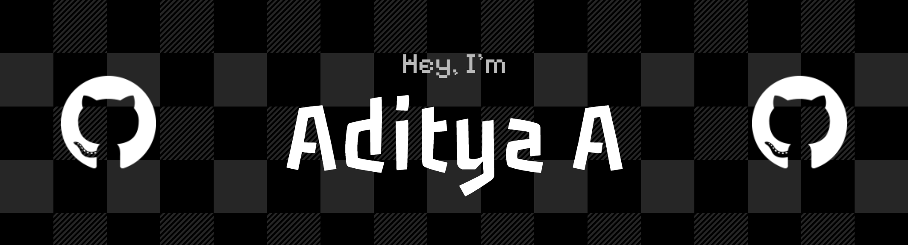

### Computer Science student and Full Stack Developer

- 🏢 Full Stack Developer Intern @theMonks.tech
- 🏆 Google Cloud Gen AI Exchange Hackathon Runner Up
- 💼 Take a look at my [Portfolio](https://aditya-a-portfolio.vercel.app)
- 💻 Most of my projects are available on [My GitHub Repositories](https://github.com/theblag?tab=repositories)
- 📫 How to reach me: **adityaarun2006@gmail.com**

## 🛠️ Tech Stack

### 💻 Programming Languages

### 🤖 Machine Learning & Data Science

### 🌐 Web Development

### 🛠️ Backend & Databases

### 🚀 Deployment Platforms

### 🎨 Design & 3D

## 📊 Stats

## 🌐 Connect with me

  

  

